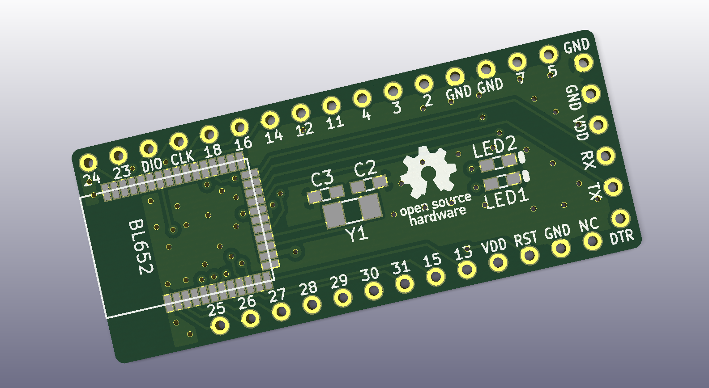

# BL652-breakout

LairdTechのnRF52832モジュールBL652のブレークアウト基板

Adafruit [Feather nRF52](https://www.adafruit.com/product/3406)の[ブートローダー](https://github.com/adafruit/Adafruit_nRF52_Arduino)を書き込むことを意識して設計してあり、書き込み後はArduino Pro Mini用のusbシリアル変換アダプタを挿せばArduinoで開発できます

部品表

| Name | Qty | Description | Manufacturer
----|----|----|----
| U1 | 1 | BL652-SA-01 | LairdTech |
| Y1 | 1 | Crystal, FC-135, 32.768kHz, 9pF | EPSON |
| C1,C4 | 2 | Capacitor, 0.1uF, 1608 ||
| C2,C3 | 2 | Capacitor, 12pF, 1608 ||
| R1 | 1 | Resistor, 1k Ohm, 1608 ||
| R2 | 1 | Resistor, 330 Ohm, 1608 ||
| R3 | 1 | Resistor, 10k Ohm, 1608 ||
| D1 | 1 | Diode, 1N4148W | Diodes Incorporated |
| LED1 | 1 | Led, Red, 1608 ||
| LED2 | 1 | Led, Yellow Green, 1608 ||

## License

https://creativecommons.org/licenses/by/4.0/
